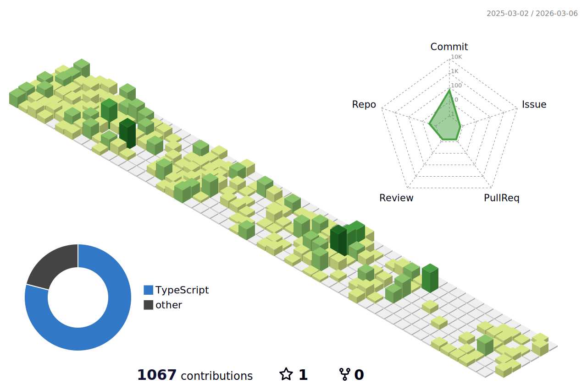

Frontend dev who recently fell into the Flutter rabbit hole 🐇

Still figuring it all out — but having fun doing it 💫

Writing code, chasing dreams, and fixing bugs 🐞

よろしくお願いします！(a.k.a. 薫子ちゃん、めっちゃかわいい！🩷✨)

Frontend dev who recently fell into the Flutter rabbit hole 🐇

Still figuring it all out — but having fun doing it 💫

Writing code, chasing dreams, and fixing bugs (mostly) 🐞

### 💻 Language & Frameworks

---

### 🧰 Others / Tools

---

